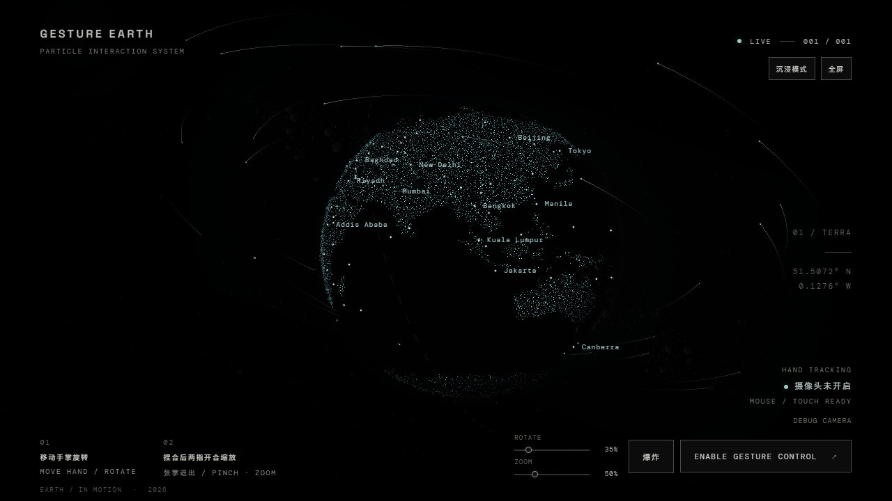

# Gesture Particle Earth / 手势交互粒子地球

An immersive particle Earth controlled by real hand gestures, mouse, or touch. Built with TypeScript, Three.js, GLSL, and MediaPipe Tasks Vision. No server is required; camera frames stay in the browser.

一颗可由真实手势、鼠标和触摸操控的沉浸式粒子地球。项目使用 TypeScript、Three.js、GLSL 和 MediaPipe Tasks Vision，纯前端运行；摄像头画面不会上传到项目服务器。全球城市光点使用本地数据，正面只显示少量不重叠的名称。

[Live demo / 在线体验](https://wujixi97-wjx.github.io/gesture-particle-earth/) · [Share ideas / 提建议](https://github.com/wujixi97-wjx/gesture-particle-earth/discussions)



## Experience / 体验

- 100,000 GPU rendered particles at the highest quality tier, with Natural Earth coastlines and a translucent atmosphere.
- Real, on-device hand tracking in a Web Worker. Recognition does not use mock data in the shipped UI.
- Move one hand to rotate; pinch and change thumb–index spacing to zoom. Use the on-screen button or a mouse double-click to explode and reassemble the Earth.
- Local city markers cover populated countries and regions; only a few front-facing names appear at once to keep the globe readable.
- City selection, a restrained day/night effect, immersive/fullscreen modes, and a slow idle tour are available.
- Mouse/touch fallback, rotation and zoom sensitivity controls, automatic quality scaling, camera debug preview, and `?debug=true` diagnostics.

高档位约 10 万粒子，包含可辨认的大陆和克制的大气层。移动单手旋转；捏合后通过拇指与食指的间距缩放。爆炸与聚合由页面按钮或鼠标双击切换。还支持城市探索、昼夜层次、沉浸展示与闲置巡航；没有摄像头或拒绝授权时可用鼠标和触摸操作。

## Run / 运行

Requires Node.js 24 or newer. / 需要 Node.js 24 或更新版本。

```bash
npm install
npm run dev
```

Open the local URL printed by Vite. The model, WASM files, and map mask are self hosted in `public/`. `npm run dev` and `npm run build` automatically compile the classic gesture Worker into `public/recognizer.worker.js`. If they are missing after a fresh clone, run `npm run assets` once while connected to the internet. The asset generation script downloads the official MediaPipe model and Natural Earth data, then creates a local SVG map mask and city catalogue.

打开 Vite 输出的本地地址。开发与构建命令会自动生成 classic 手势 Worker；模型、WASM 和世界地图 Mask 位于 `public/`，随仓库发布。若克隆后资源缺失，可联网执行一次 `npm run assets`。

```bash
npm run build
npm run preview
npm run test
npm run test:e2e
npm run cities  # regenerate the local city catalogue (internet required)
```

`npm run build` includes TypeScript checking. `npm run preview` serves the production build. End-to-end tests use the installed Google Chrome browser through Playwright. Install Chrome before running `npm run test:e2e`.

## Controls / 操作

| Input | Action | 中文 |
|---|---|---|
| Move one hand | Rotate Earth | 移动单手旋转 |
| Pinch, then spread or close thumb and index | Zoom | 捏合后两指开合缩放 |
| Hold an open palm for about 200 ms while zooming | Return to rotation | 缩放时稳定张掌约 200 毫秒，恢复旋转 |
| Explosion / assembly button | Toggle particle effect | 点击“爆炸／聚合”按钮切换特效 |
| Mouse drag / scroll / double click | Rotate / zoom / toggle explosion | 鼠标拖动 / 滚轮 / 双击 |
| One-finger drag / two-finger pinch | Rotate / zoom | 手机单指旋转 / 双指缩放 |
| Click a visible city marker or name | Focus on the city | 点击城市光点或名称定位 |
| Immersive / fullscreen buttons | Change presentation | 切换沉浸或全屏展示 |

After roughly 15 seconds without input, the Earth slowly tours itself. Any interaction pauses the tour. The tour is disabled while the camera is active or reduced motion is preferred. In immersive mode, moving the mouse or tapping the screen temporarily reveals the controls.

约 15 秒无操作后，地球会缓慢巡航；用户操作会立即暂停。摄像头启用或系统要求减少动态效果时不自动巡航。沉浸模式下，移动鼠标或点击屏幕可临时唤出控件。

The first camera request happens only after clicking **ENABLE GESTURE CONTROL**. The browser requires HTTPS or localhost for camera access. If permission is denied, the camera is absent, or MediaPipe fails to load, the experience stays interactive through mouse and touch.

只有点击 **ENABLE GESTURE CONTROL** 才会申请摄像头权限。浏览器要求 HTTPS 或 localhost。拒绝授权、无设备或模型加载失败时，页面自动转入鼠标/触摸模式。

## Structure / 结构

```text
src/
  core/       scene lifecycle, app state, quality manager
  earth/      particle geometry, city markers, atmosphere, GPU animation
  data/       generated local city catalogue
  gesture/    MediaPipe worker, camera, gesture smoothing and intent
  effects/    stars and space dust
  input/      mouse and touch controls
  shaders/    particle and atmosphere GLSL
  ui/         HUD and debug camera
  config.ts   typed constants and quality tiers
public/       locally hosted gesture model, WASM and map mask
scripts/      repeatable asset preparation
tests/        unit and browser tests
```

## Performance and privacy / 性能与隐私

Quality tiers draw 100k, 55k, or 28k particles and cap DPR at 2, 1.5, or 1.25. Sustained low FPS reduces quality; recovery is deliberately slower to avoid oscillation. MediaPipe processes webcam frames in a dedicated browser Worker. This project does not send video frames to a backend. The MediaPipe runtime may perform its own usage metrics as described in [Google's MediaPipe privacy notice](https://developers.google.com/edge/mediapipe/solutions/tasks).

性能等级会调整粒子数与 DPR。帧率持续下降时自动降档，恢复需持续稳定一段时间。视频帧只在本地 Worker 处理；第三方 MediaPipe 运行时的指标政策见其官方隐私说明。

## Deploy to GitHub Pages / 发布

Push this repository to GitHub with `main` as the default branch. In repository Settings → Pages, select **GitHub Actions** as the source. The included workflow builds the project and publishes `dist/`. Vite uses relative asset paths, so the app also works beneath a repository subpath.

将仓库推送到 GitHub，默认分支为 `main`，在 Settings → Pages 选择 **GitHub Actions**。工作流会构建并发布 `dist/`，资源路径支持仓库子目录。

## Feedback / 欢迎建议

Share ideas about visual detail, gesture usability, accessibility, and performance in [Discussions](https://github.com/wujixi97-wjx/gesture-particle-earth/discussions). Use Issues for reproducible bugs; include browser, device, steps to reproduce, and a screenshot if helpful. Do not upload webcam footage or private data.

欢迎在 [Discussions](https://github.com/wujixi97-wjx/gesture-particle-earth/discussions) 讨论视觉细节、手势易用性、无障碍和性能；可复现的问题请发到 Issues，并附浏览器、设备与复现步骤。请勿上传摄像头画面或私人信息。

## Asset provenance / 资源来源

- Land polygons: [Natural Earth 1:110m land](https://github.com/nvkelso/natural-earth-vector), public domain. Generated into `public/world-mask.svg`.
- City points: [Natural Earth Populated Places](https://www.naturalearthdata.com/downloads/110m-cultural-vectors/110m-populated-places/) at 1:110m, with 1:50m/1:10m fallbacks for map units absent from the smaller set. The checked-in catalogue is generated by `npm run cities`; [Natural Earth terms](https://www.naturalearthdata.com/about/terms-of-use/) place the data in the public domain. Antarctica (ATA) and French Southern and Antarctic Lands (ATF) have no permanent city in this catalogue and are intentionally not given invented markers.
- Gesture model: [MediaPipe Gesture Recognizer](https://developers.google.com/edge/mediapipe/solutions/vision/gesture_recognizer), hosted locally in `public/mediapipe/gesture_recognizer.task`.
- WASM runtime: copied from the installed `@mediapipe/tasks-vision` package into `public/mediapipe/wasm/`; keep the package version aligned with the copied runtime.
- Fonts: Google Fonts, with local system fallbacks. The experience still runs if font loading fails.

## Known limitations and next steps / 已知限制与后续方向

- Fine geographical details are limited by the 1:110m source and particle density. Natural Earth 1:50m data can improve coastlines at a higher asset cost.
- Hand tracking quality depends on lighting, background, device camera, and CPU. Some browsers may support mouse/touch but not Worker based MediaPipe execution.
- Automated tests can validate input logic, rendering startup, and fallbacks; gesture quality and FPS must also be checked on real devices.
- Next steps: an accessible guided tutorial, more performance telemetry, and real-device checks across cameras and GPUs.

地图细节受到 Natural Earth 1:110m 数据和粒子密度限制。手势质量受光照、背景、摄像头及设备性能影响。后续可完善无障碍引导、性能监测和不同设备的实测。
